# ⛅ Weather Make Together

Красочное погодное приложение с мультяшным Зевсом, которое делает прогноз волшебным! 🌈⚡  
Поддерживает **светлую** и **тёмную** темы оформления.

<p align="center">
  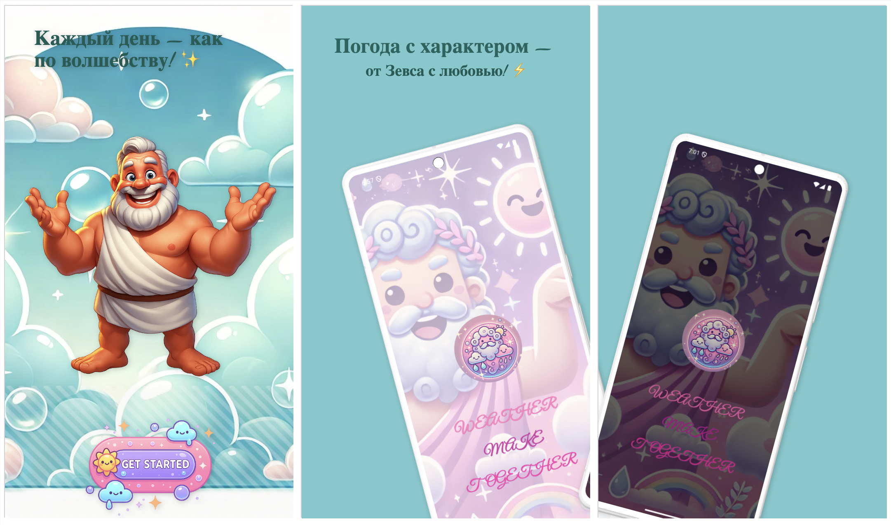
  <br/><strong>Погода с характером — от Зевса с любовью! ⚡</strong>
</p>

<p align="center">
  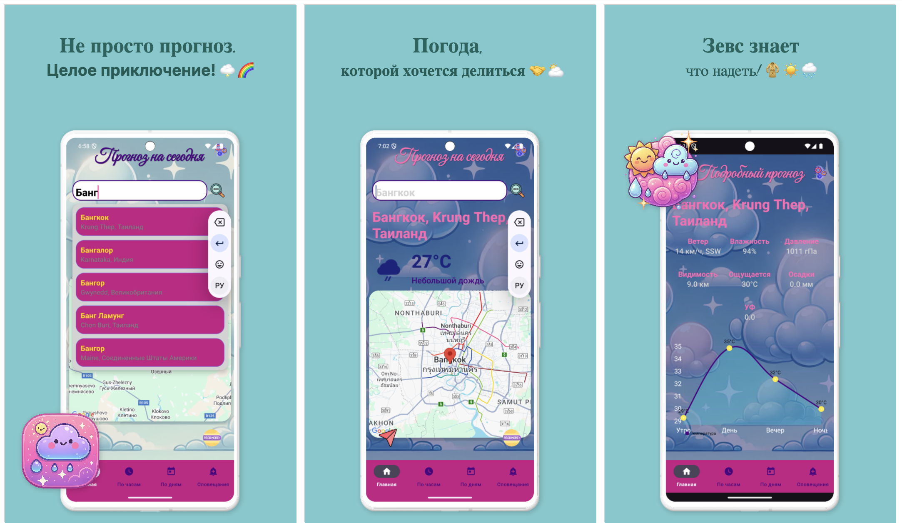
  <br/><strong>Зевс знает, что надеть! 🧥☀️🌧️</strong>
</p>

<p align="center">
  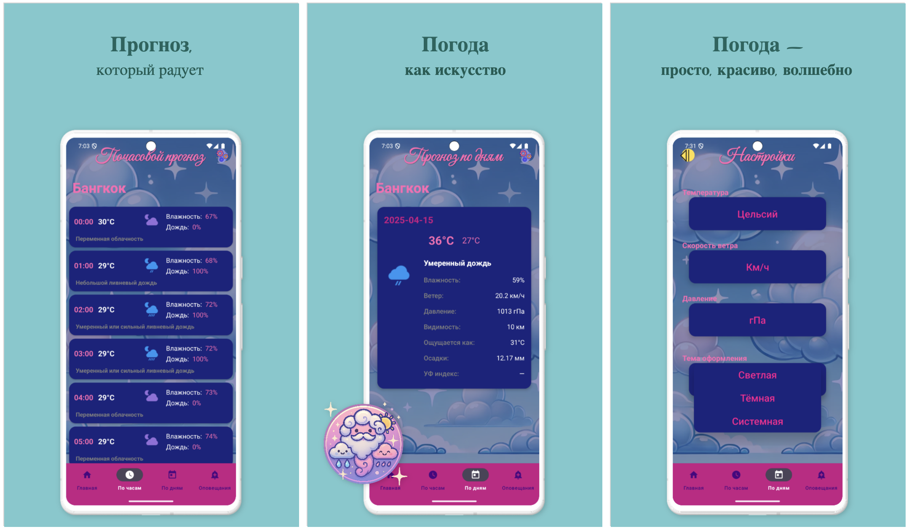
  <br/><strong>Не просто прогноз. Целое приключение! 🌩️🌈</strong>
</p>

---

## 📱 Основные возможности

- 🔍 Умный поиск городов
- 📅 Прогнозы: на **сегодня**, **по часам**, **по дням**
- 🌪️ Оповещения о шторме и других катаклизмах
- 🎨 Светлая и тёмная темы
- ☁️ Мультяшный Зевс — главный помощник!

---

## 🌈 Скриншоты

### 🌞 Светлая тема

<table>
  <tr>
    <th>Splash</th>
    <th>Поиск</th>
    <th>Сегодня</th>
    <th>Подробнее</th>
    <th>Почасовой</th>
    <th>По дням</th>
    <th>Настройки</th>
  </tr>
  <tr>
    <td>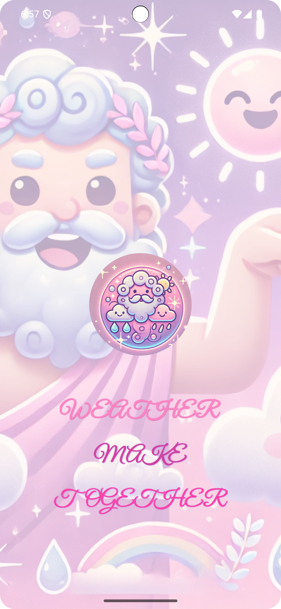</td>
    <td>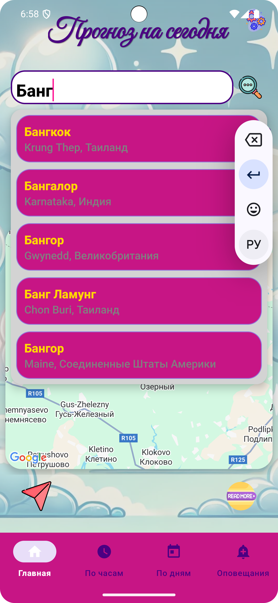</td>
    <td>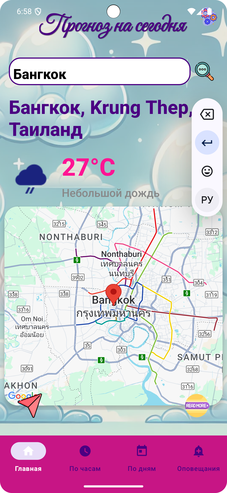</td>
    <td>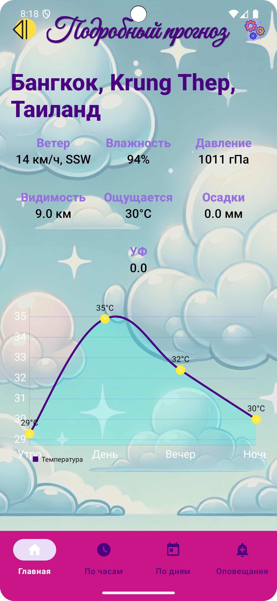</td>
    <td>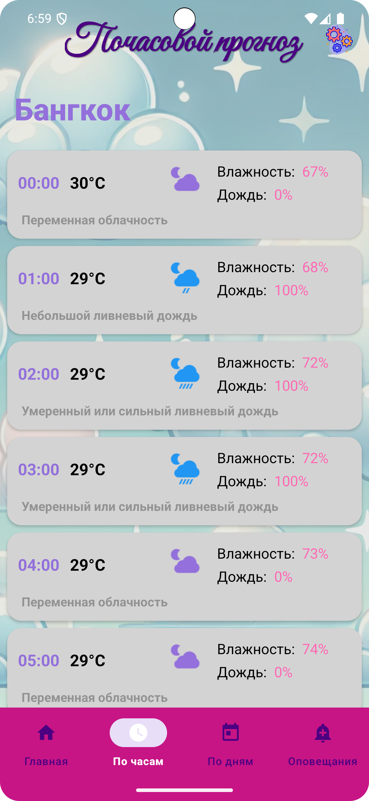</td>
    <td>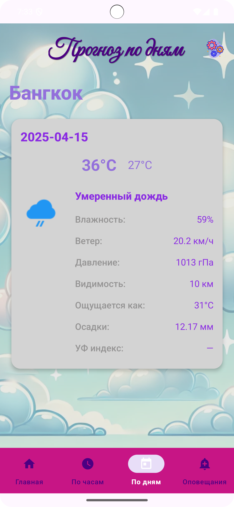</td>
    <td></td>
  </tr>
</table>

---

### 🌙 Тёмная тема

<table>
  <tr>
    <th>Splash</th>
    <th>Поиск</th>
    <th>Сегодня</th>
    <th>Подробнее</th>
    <th>Почасовой</th>
    <th>По дням</th>
    <th>Настройки</th>
  </tr>
  <tr>
    <td>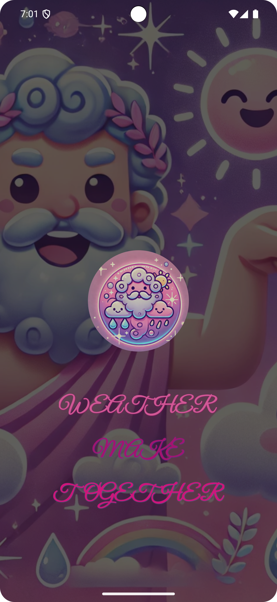</td>
    <td>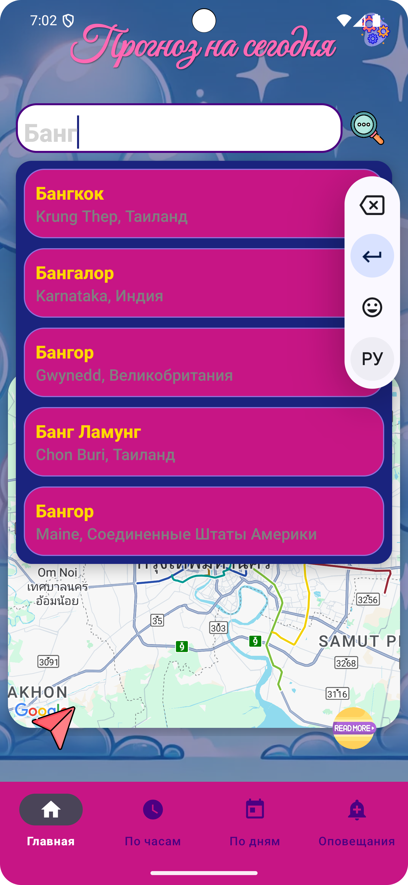</td>
    <td>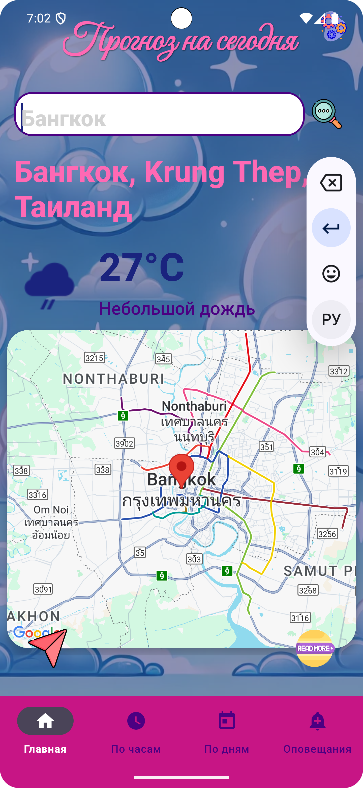</td>
    <td></td>
    <td>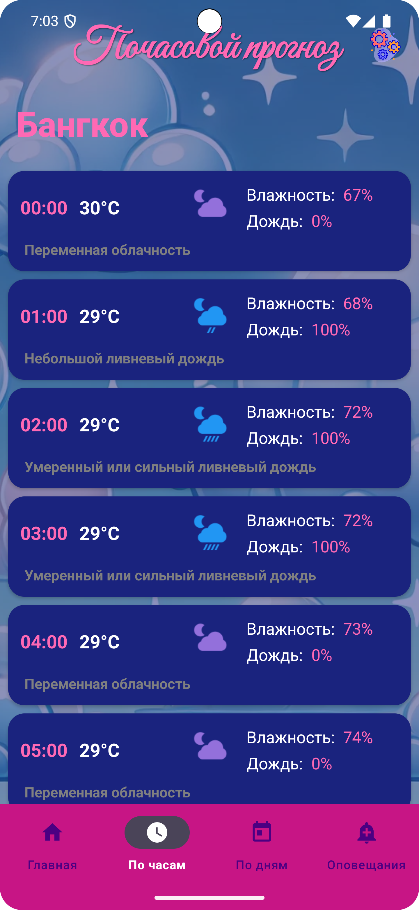</td>
    <td>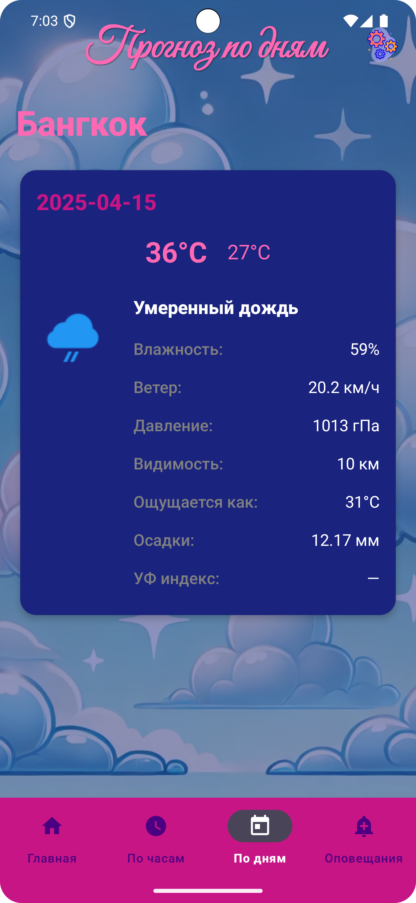</td>
    <td>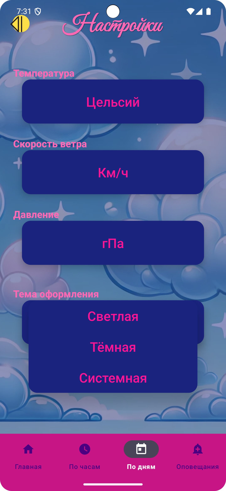</td>
  </tr>
</table>

---

## 🚀 Установка

📦 APK: [Скачать релиз](https://github.com/Maphick/WeatherJustTogether/releases)

Или собрать вручную:

```bash
git clone https://github.com/Maphick/WeatherJustTogether.git
cd WeatherJustTogether
./gradlew installDebug
